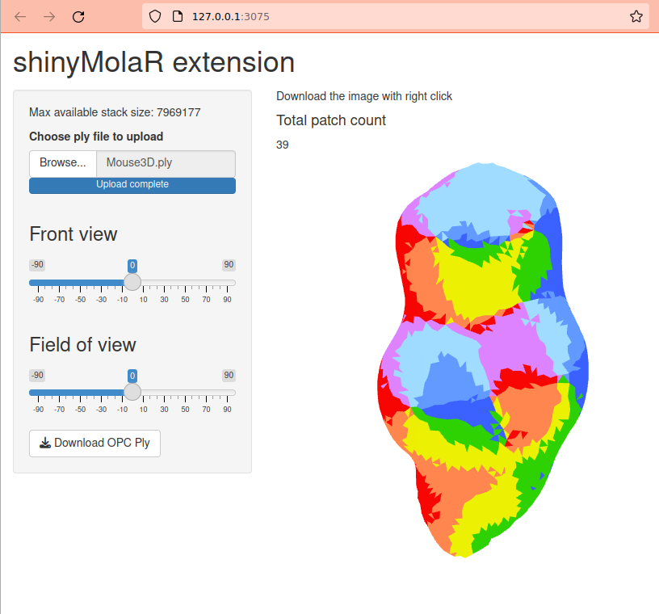

<!-- README.md is generated from README.Rmd. Please edit that file -->

```{r, include = FALSE}
knitr::opts_chunk$set(
  collapse = TRUE,
  comment = "#>",
  fig.path = "man/figures/README-",
  out.width = "100%"
)
```

# shinyMolar

<!-- badges: start -->
<!-- badges: end -->

The shinyMolar is an extension of [molaR](https://cran.r-project.org/package=molaR) package to provide an UI interface for OPC function.  

## Installation

You can install the development version of shinyMolar from [GitHub](https://github.com/dasroy/shinyMolar) with:

``` r
if(!require(devtools)) { 
    install.packages("devtools")
}
devtools::install_github("dasroy/shinyMolar")
```

## Example

This is a basic example which shows you how launch shinyMolar interface:

```{r example,eval=FALSE}
library(shinyMolar)
shinyMolaR()
```

By default the application will be launch in a browser (which is required), otherwise copy and open the URL from your console to browser. 


