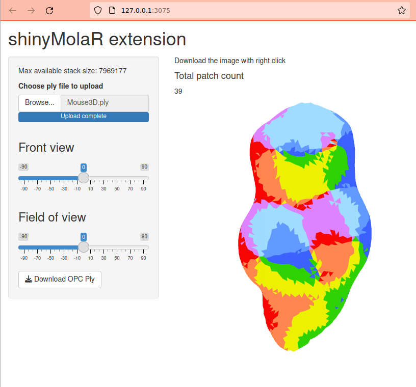

<!-- README.md is generated from README.Rmd. Please edit that file -->

# shinyMolar

<!-- badges: start -->
<!-- badges: end -->

The shinyMolar provides an UI interface of molaR package

## Installation

You can install the development version of shinyMolar from
[GitHub](https://github.com/) with:

``` r
# install.packages("devtools")
devtools::install_github("dasroy/shinyMolar")
```

## Example

This is a basic example which shows you how launch shinyMolar interface:

``` r
library(shinyMolar)
shinyMolaR()
```

Now copy and open the URL from your console to browser.


